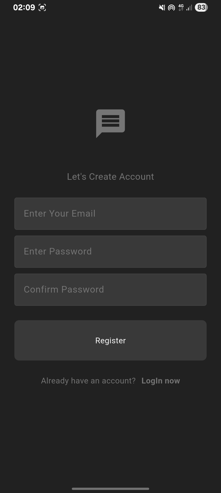
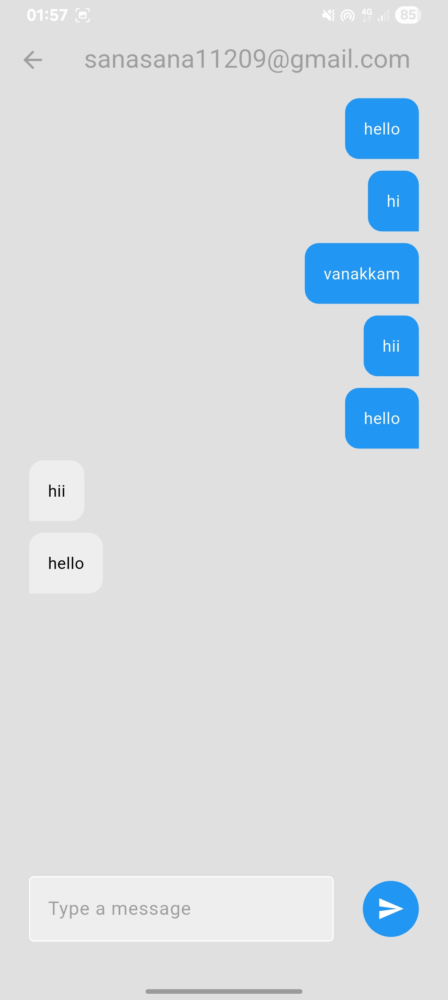

---

# 📱 Chatty — Flutter Chat Application


Chatty is a simple cross-platform chat application built using **Flutter**, integrated with **Firebase** for real-time messaging and **Shared Preferences** for storing local user data.
It is lightweight, beginner-friendly, and ideal for learning Flutter + Firebase integration.

---

## 🚀 Features

-  Real-time messaging with Firebase
-  User account persistence using SharedPreferences
-  Cross-platform (Android, iOS)
-  Clean and modular Flutter architecture
-  Dark theme support
-  Firebase project configuration included
-  Easy to customize UI and logic

---

## 📸 App Screenshots

| Login Screen               | Signup Screen            | Home Screen                | Chat Screen              |
| -------------------------- | ------------------------ | -------------------------- | ------------------------ |
|  |  |  |  |


---

## 📁 Folder Structure

```
Chatty/
├── android/               # Android configuration
├── ios/                   # iOS configuration
├── web/                   # Web build files
├── linux/                 # Linux desktop files
├── macos/                 # macOS files
├── windows/               # Windows files
├── lib/
│   ├── main.dart          # App entry point
│   ├── pages/             # UI Screens
│   ├── services/          # Firebase & local services
│   ├── components/        # Reusable components
|   ├── themes/            # Custom theme files
|   ├── models/
|   ├── firebase_options.dart
├── assets/                # Images & icons
├── firebase.json          # Firebase configuration
├── pubspec.yaml           # Dependencies
└── README.md              # Documentation
```

---

## 🔧 Tech Stack

| Technology                     | Purpose              |
| ------------------------------ | -------------------- |
| **Flutter**                    | UI & App Development |
| **Firebase Realtime Database** | Messaging backend    |
| **Shared Preferences**         | Local storage        |
| **Dart**                       | Programming language |

---

## ⚙️ Installation & Setup

### 1️⃣ Clone the repository

```bash
git clone https://github.com/Vithu-29/Chatty.git
cd Chatty
```

### 2️⃣ Install dependencies

```bash
flutter pub get
```

### 3️⃣ Configure Firebase

You must create your own Firebase project:

#### Step-by-step:

1. Go to **[https://console.firebase.google.com](https://console.firebase.google.com)**
2. Create a new project
3. Add your app:

   * Android → Add `google-services.json`
   * iOS → Add `GoogleService-Info.plist`
4. Enable **Realtime Database**
5. Update the database rules if needed (demo only):

   ```json
   {
     "rules": {
       ".read": true,
       ".write": true
     }
   }
   ```

### 4️⃣ Run the project

```bash
flutter run
```

---

## 🧪 Build Instructions

| Platform              | Command                   |
| --------------------- | ------------------------- |
| **Android APK**       | `flutter build apk`       |
| **Android AppBundle** | `flutter build appbundle` |

---


## 💬 Contact

- **GitHub:** [Vithu-29](https://github.com/Vithu-29)
- **LinkedIn:** [Vithushan Kanesamoorthy](https://www.linkedin.com/in/vithu29/)

---
